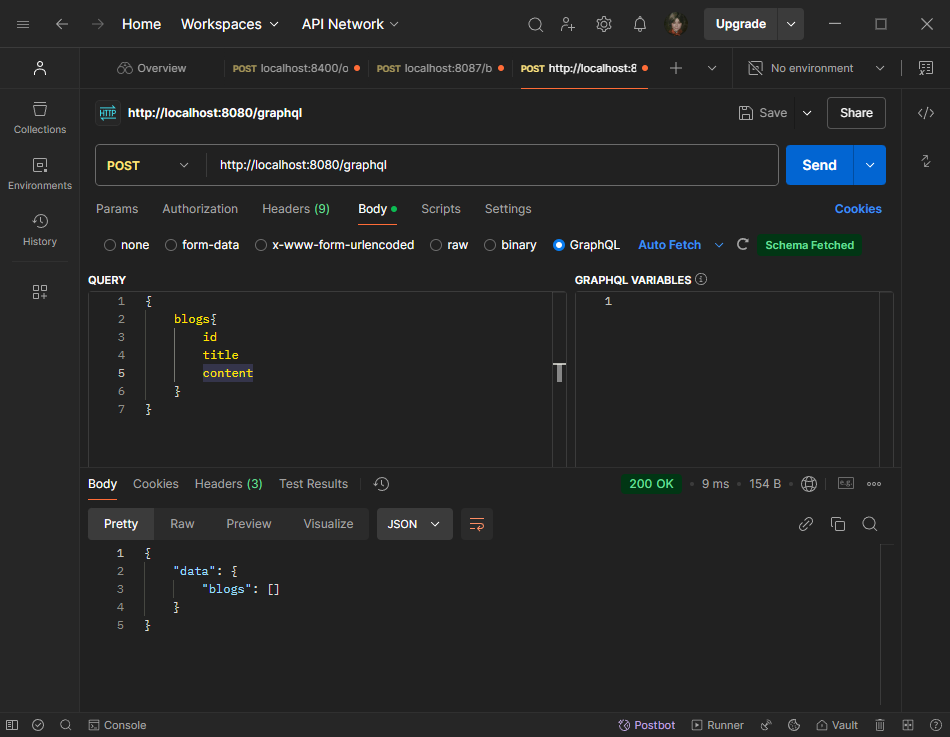
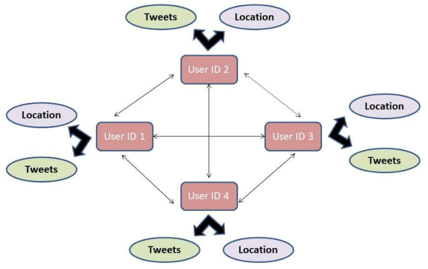
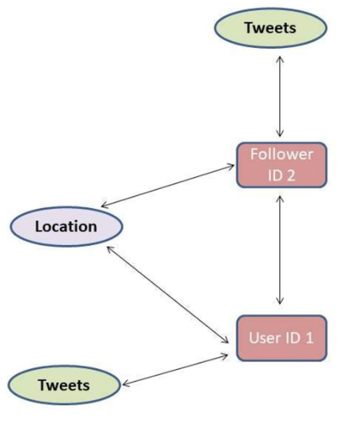

# Тестовый проект с использованием GraphQL


## Для использования GraphQL:
1. Определить структуры, представляющие данные
2. Создать типы GraphQL
3. Определить схему GraphQL
4. Настроить http-сервер

## Установка GraphQL в Go
Пакет:
```bash
go get github.com/graphql-go/graphql
```

http-обработчик
```bash
go get github.com/graphql-go/handler
```


## Тестирование в Postman:


------------------------------------


По материалам [статьи на Хабре](https://habr.com/ru/articles/765064/)

Дополнительные ресурсы:
- [GraphQL](https://graphql.org/) — Официальный сайт
- [Learn GraphQL](https://gitconnected.com/learn/graphql) — GraphQL руководства

## Введение
 GraphQL — это язык запросов и серверная среда для API с открытым исходным кодом. Он появился в Facebook в 2012 году и был разработан для упрощения управления конечными точками для API на основе REST.
 
В 2015 году код GraphQL стал открытым, и сейчас GraphQL используют Airbnb, GitHub, Pinterest, Shopify и многие другие компании.
 Когда разработчики Facebook создавали мобильное приложение, они искали способы ускорить работу. Была трудность: при одновременном запросе из различных по типу баз данных, например из облачной Redis и MySQL, приложение ужасно тормозило. Для решения задачи в Facebook придумали собственный язык запросов, который обращается к конечной точке и упрощает форму запрашиваемых данных. Особенно это было актуально для соц-сети, где много связей и запросов по связанным элементам — например, получить посты всех подписчиков пользователя X.

REST - хорошая штука, но у него есть некоторые проблемы с которыми и столкнулся Facebook:

Во-первых, это избыточность или недостаток данных в ответе. В REST API клиенты часто получают либо слишком много данных, которые им не нужны, либо слишком мало, что вынуждает делать несколько запросов для получения необходимой информации. GraphQL позволяет клиентам запрашивать только те данные, которые им нужны, и получать их в одном запросе, что делает коммуникацию более эффективной.

Также в REST API каждый эндпойнт обычно соответствует определенному ресурсу, что может привести к проблемам с расширяемостью и поддержкой разных версий API. В GraphQL же существует единая конечная точка для всех запросов, и схема API определяется на стороне сервера. Это делает API более гибким и облегчает его развитие.

Ну а также во многих REST API при работе со связанными данными возникает проблема "N+1 запросов", когда для получения связанных данных нужно делать дополнительные запросы к серверу. GraphQL позволяет выразить связи между данными и получать все необходимые данные в одном запросе.

Например, на том же Фейсбуке есть много пользователей, и для каждого пользователя нам нужно получить список его последних постов.

В классическом REST API, чтобы получить такие данные, пришлось бы сделать несколько запросов к серверу: один запрос к эндпойнту пользователей для получения списка пользователей и запрос к энпойнту постов, у которого мы запросим посты для всех найденных пользователей (либо вообще по одному запросу на каждого нужного пользователя — но это реже). С использованием GraphQL эта проблема может быть решена более эффективно. Можно запросить список пользователей и, одновременно, указать, что для каждого пользователя нужно получить последние посты.

Пример запроса в GraphQL может выглядеть так, где мы запрашиваем 5 последних постов пользователей:

```
query {
  users {
    id
    name
    posts(last: 5) {
      id
      text
      timestamp
    }
  }
}
```
А благодаря чему так происходит? Именно благодаря структуре GraphQL. Почему он Graph? Потому что он представляет собой структуру данных в виде графа, где узлы графа представляют собой объекты, а рёбра - связи между этими объектами. Это отражает способ организации данных и запросов в GraphQL, где клиенты могут запрашивать связанные данные, а также только те данные, которые им нужны.

Вот, например, граф, который показывает все отношения приложения соц-сети:


## Как нам получить доступ к графу через GraphQL?
GraphQL переходит к определенной записи, которая называется корневым узлом, и дает указание получить все детали этой записи.


Мы можем взять, например, пользователя 1, и получить данные его подписчика. Давайте напишем фрагмент запроса GraphQL, чтобы показать, как получить к нему доступ:

```
query {
  user(id: "1") {
    followers {
      tweets {
        content
      }
    }
  }
}
```
Здесь мы просим GraphQL перейти к графу из корневого узла, который является объектом пользователя с аргументом id: 1, и получить доступ к содержимому твита подписчика.

Для начала неплохо, но давайте обсудим, какие бывают запросы в GraphQL подробнее.

## Типы запросов GraphQL

Типы запросов в GraphQL сводятся к основным трём:
- Query
- Mutation
- Subscription

Query: запросы в GraphQL
С ними мы уже немного познакомились в наших примерах раньше.

C помощью Query GraphQL получает необходимые данные с сервера. Тип запроса `Query` в GraphQL — аналог `GET` в REST. Запросы — строки, которые отправляются в теле HTTP POST-запроса.

Обратите внимание, все типы запросов в GraphQL отправляются через POST. Но это если мы говорим про обмен по HTTP, и это самый распространённый вариант. Но GraphQL также может работать и через Веб-сокеты, и через gRPC, и поверх других транспортных протоколов.

Примеры Query мы уже видели, но давайте ещё раз для закрепления: получим параметры `fname` и age всех пользователей:
```
query {
  users {
    fname
    age
  }
}
```
В ответ на этот запрос сервер присылает данные в формате JSON. Структура ответа соответствует структуре запроса:
```json
data : {
  users [
    {
      "fname": "Joe",
      "age": 23
    },
    {
      "fname": "Betty",
      "age": 29
    }
  ]
}
```

В ответе приходит JSON с ключом `data`  и с ключом `errors` , если есть какие-то ошибки.

Вот пример ответа, в котором возникла ошибка из-за того, что у `Alice` в возрасте почему-то текстовое значение:
```json
{
  "errors": [
    {
      "message": "Ошибка: Поле 'age' имеет недопустимое значение 'test'.",
      "locations": [
        {
          "line": 5,
          "column": 5
        }
      ],
      "path": ["users", 0, "age"]
    }
  ],
  "data": {
    "users": [
      {
        "fname": "Alice",
        "age": "test"
      },
      {
        "fname": "Bob",
        "age": 32
      }
    ]
  }
}
```

## Mutation: мутации в GraphQL
С помощью мутаций можно добавлять данные в базу. Mutation — это аналог POST и PUT в REST. Вот пример кода:
```
mutation createUser{
  addUser(fname: "Richie", age: 22) {
    id
  }
}
```
Здесь создаётся мутация createUser, которая добавляет в БД пользователя с `fname` `Richie` и `age` `22`. В ответ на этот запрос сервер присылает JSON с id записи. Ответ выглядит так:
```json
data : {
addUser : "a36e4h"
}
```

## Subscription: подписки в GraphQL
С помощью подписок клиент слушает изменения в БД в режиме реального времени. Под капотом подписки используют Веб-сокеты. Пример кода:
```
subscription listenLikes {
  listenLikes {
    fname
    likes
  }
}
```
С помощью этого запроса можно, например, получать список пользователей с именами и количеством лайков каждый раз, когда оно меняется.

Например, когда пользователь с `fname` `Richie` получает лайк, ответ будет таким:
```json
data: {
listenLikes: {
    "fname": "Richie",
    "likes": 245
  }
}
```
Подобный запрос можно использовать для обновления количества лайков в режиме реального времени в соответствующем интерфейсе, например, в форме с результатами голосования на сайте.

## Концепции в запросах GraphQL
Примеры разных запросов мы уже посмотрели, но теперь давайте разберёмся, как называть и организовывать эти элементы, которые используются в GraphQL.

Концепции, которые мы рассмотрим:

 1. Поля (Fields)
 2. Аргументы (Arguments)
 3. Псевдонимы (Aliases)
 4. Фрагменты (Fragments)
 5. Переменные (Variables)
 6. Директивы (Directives)

### Поля 
Давайте посмотрим на простой запрос GraphQL:
```
{
  user {
    name
  }
}
```
В этом запросе вы видите 2 поля. Поле `user` возвращает объект, в котором есть другое поле, типа `String`.

Мы попросили сервер GraphQL вернуть объект пользователя с его именем, тут всё просто, идём дальше.

### Аргументы (Arguments)

Вы можете передать аргумент, чтобы указать, на какого пользователя мы хотим ссылаться.
Пример:
```
{
  user(id: "1") {
    name
  }
}
```
Мы передаем `id` пользователя, но мы могли бы также передать аргумент `name`, предполагая, что у API есть функция для возврата с таким ответом.

У нас также может быть аргумент `limit`, указывающий, сколько подписчиков мы хотим вернуть в ответе.

Пример:
```
{
  user(id: "1") {
    name
    followers(limit: 50)
  }
}
```

### Псевдонимы (Aliases)
Псевдонимы (aliases) в GraphQL используются для переименования полей в ответе запроса. Это полезно, когда вы хотите получить данные из нескольких полей с одинаковыми именами, но хотите, чтобы они имели разные имена в ответе. Вот пример запроса GraphQL с использованием псевдонимов:

Пример:
```
query {
  products {
    name
    description
  }
  users {
    userName: name
    userDescription: description
  }
}
```
И пример ответа:
```json
{
  "data": {
    "products": [
      {
        "name": "Product A",
        "description": "Description A"
      },
      {
        "name": "Product B",
        "description": "Description B"
      }
    ],
    "users": [
      {
        "userName": "User 1",
        "userDescription": "User Description 1"
      },
      {
        "userName": "User 2",
        "userDescription": "User Description 2"
      }
    ]
  }
}
```
Так мы в ответе можем отличить имя и описание продукта от имени и описания пользователя. Помните, мы также делаем и в SQL, когда, например, нужно при объединении двух таблиц в результате различить похожие названия двух столбцов. Обычно эта проблема возникает с колонками `id` и `name`.

### Фрагменты (Fragments)
Концепция фрагментов часто используется для разделения сложных требований к данным приложения на более мелкие порции, особенно когда вам нужно объединить множество компонентов пользовательского интерфейса с различными фрагментами в одну начальную выборку данных.

Пример:
```
{
  leftComparison: tweet(id: 1) {
    ...comparisonFields
  }
  rightComparison: tweet(id: 2) {
    ...comparisonFields
  }
}

fragment comparisonFields on tweet {
  userName
  userHandle
  date
  body
  repliesCount
  likes
}
```
Что происходит в этом запросе?

 1. Мы отправляем два запроса для получения информации о двух разных твитах: твит с `id 1` и твит с `id 2`.

 2. Для каждого запроса мы создаем псевдонимы: `leftComparison` и `rightComparison`.

 3. И мы используем фрагмент `comparisonFields`, который содержит набор полей, которые мы хотим получить для каждого твита. Фрагменты позволяют нам избежать дублирования кода и переиспользовать один и тот же набор полей в нескольких местах запроса.

Вот какой ответ мы получим:
```json
{
  "data": {
    "leftComparison": {
      userName: "foo",
      userHandle: "@foo",
      date: "2019-05-01",
      body: "Life is good",
      repliesCount: 10,
      tweetsCount: 200,
      likes: 500,
    },
    "rightComparison": {
      userName: "boo",
      userHandle: "@boo",
      date: "2018-05-01",
      body: "This blog is awesome",
      repliesCount: 15,
      tweetsCount: 500,
      likes: 700
  }
}
```

### Переменные (Variables)
Переменные GraphQL – это способ динамического указания значения, которое используется в запросе. Как вы видели выше, мы передали наши аргументы внутри строки запроса. Мы будем передавать аргументы с переменной.

В примере мы добавили идентификатор пользователя id в качестве строки внутри запроса:
```
{
  accholder: user(id: "1") {
    fullname: name
  }
}
```
Давайте теперь добавим переменную и заменим статическое значение. То же самое можно записать как:

```
query GetAccHolder($id: String) {
  accholder: user(id: $id) {
    fullname: name
  }
}

{
  "id": "1"
}
```
Здесь `GetAccHolder` является именованной функцией. Полезно использовать именованную функцию, когда у вас много запросов в вашем приложении.

Потом мы объявили переменную `$id` с типом `String`. Ну а дальше уже также, как и в нашем изначальном запросе, но вместо фиксированного `id`, мы в запросе отдали переменную `$id`.
Ну а значения переменных передаются в отдельном блоке. В нашем случае `id = 1`.

Мы можем указать значение по умолчанию для переменной:
```
query GetAccHolder($id: String = "1") {
  accholder: user(id: $id) {
    fullname: name
  }
}
```
Также мы можем сделать переменную, как обязательную, добавив `!` к типу данных:
```
query GetAccHolder($id: String!) {
  accholder: user(id: $id) {
    fullname: name
  }
```

### Директивы (Directives)
Теперь давайте посмотрим, как можно динамически генерировать структуру запроса, используя директивы.

Директивы помогают динамически изменять структуру и форму наших запросов с помощью переменных.

`@include` и `@skip` – две директивы, доступные в GraphQL

Пример директивы:

```@include(if: Boolean) ```— Включить поле, если значение boolean-переменной = true
```
query GetFollowers($id: String) {
  user(id: $id) {
    fullname: name,
    followers: @include(if: $getFollowers) {
      name
      userHandle
      tweets
    }
  }
}

{
  "id": "1",
  "$getFollowers": false
}
```
Здесь `$getFollowers` имеет значение `false`, следовательно, поле имён подписчиков `followers` не будет включено в ответ.

`@skip(if: Boolean)` — Пропустить поле, если значение boolean-переменной = true

```
query GetFollowers($id: String) {
  user(id: $id) {
    fullname: name,
    followers: @skip(if: $getFollowers) {
      name
      userHandle
      tweets
    }
  }
}
{
  "id": "1",
  "$getFollowers": true
}
```

Здесь `$getFollowers` имеет значение `true`, следовательно, поле имен подписчиков `followers` будет пропущено, т. е. исключено из ответа.

### Схема GraphQL
Чтобы работать с GraphQL на сервере нужно развернуть схему GraphQL (Schema), где прописывается логика работы GraphQL API, типы и структура данных. Схема состоит из двух взаимосвязанных объектов: TypeDefs и Resolvers.

Выше были описаны основные типы GraphQL. Чтобы сервер мог с ними работать, эти типы необходимо определить. Объект typeDef определяет список типов, которые доступны в проекте. Код выглядит так:
```
const typeDefs= gql`
  type User {
    id: Int
    fname: String
    age: Int
    likes: Int
    posts: [Post]
  }

  type Post {
    id: Int
    user: User
    body: String
  }

  type Query {
    users(id: Int!): User!
    posts(id: Int!): Post!
  }
  type Mutation {
    incrementLike(fname: String!) : [User!]
  }

  type Subscription {
    listenLikes : [User]
  }
`;
```
В примере выше определяется тип User, в котором указываются `fname`, `age`, `likes` и другие данные. Для каждого поля определяется тип данных: `String` или `Int`. GraphQL поддерживает четыре типа данных: `String`, `Int`, `Float`, `Boolean`. Если в поле указан восклицательный знак, оно становится обязательным.

Также в примере выше определяются типы `Query`,`Mutation` и `Subscription`.

Первый тип, который содержит внутри себя тип `Query`, называется `users`. Он принимает `id` и возвращает объект с данными соответствующего пользователя. Это обязательное поле. Ещё один тип `Query` называется `posts`. Он устроен так же, как `users`.

Тип `Mutation` называется `incrementLike`. Он принимает параметр `fname` и возвращает список пользователей.

Тип `Subscription` называется `listenLikes`. Он возвращает список пользователей.

После определения типов необходимо добавить их логику. Это нужно, чтобы сервер знал, как отвечать на запросы клиента. Эта задача решается с помощью `Resolvers`.

`Resolver` или распознаватель — функция, которая возвращает данные для определённого поля. Распознаватели возвращают данные того типа, который определён в схеме. Распознаватели могут быть асинхронными. С их помощью можно получать данные из REST API, базы данных или другого источника.

Определим Распознаватели:
```
const resolvers= {
  Query: {
    users(root, args) {return users.filter(user=> user.id=== args.id)[0] },
    posts(root, args) {return posts.filter(post=> post.id=== args.id)[0] }
  },

  User: {
    posts: (user)=> {
return posts.filter(post=> post.userId=== user.id)
    }
  },

  Post: {
    user: (post)=> {
return users.filter(user=> user.id=== post.userId)[0]
    }
  },
  Mutation: {
    incrementLike(parent, args) {
      users.map((user)=> {
if(user.fname=== args.fname) user.likes++return user
      })
      pubsub.publish('LIKES', {listenLikes: users});
return users
    }
  },
  Subscription: {
    listenLikes: {
      subscribe: ()=> pubsub.asyncIterator(['LIKES'])
    }
  }
};
```
В примере выше есть шесть функций:
- запрос `users` возвращает объект пользователя, соответствующий переданному `id`;
- запрос `posts` возвращает объект поста, соответствующий переданному `id`;
- в поле `posts` `User` распознаватель принимает данные пользователя и возвращает список его постов;
- в поле `user` `Posts` функция принимает данные поста и возвращает пользователя, который опубликовал пост;
- мутация `incrementLike` изменяет объект `users`: увеличивает количество `likes` для пользователя с соответствующим `fname`. После этого `users` публикуются в `pubsub` с названием `LIKES`;
- подписка `listenLikes` слушает `LIKES` и отвечает при обновлении `pubsub`.

Два слова о `pubsub`. Этот инструмент представляет собой систему передачи информации в режиме реального времени с использованием WebSockets. `pubsub` удобно использовать, так как всё, что касается WebSockets, вынесено в отдельные абстракции.

## Чем концептуально хорош GraphQL
- **Гибкость**. GraphQL не накладывает ограничений на типы запросов, что позволяет использовать его как для традиционных CRUD-операций (create, read, update, delete), так и для запросов, которые содержат несколько типов данных.

- **Определение схемы**. GraphQL автоматически создаёт схему для API. А за счёт иерархической организации кода и объектных отношений снижается его сложность.

- **Оптимизация запросов**. GraphQL позволяет клиентам запрашивать только ту информацию, что им нужна. Это уменьшает время ответа от сервера и количество данных, которые нужно передавать по сети.

- **Контекст**. GraphQL учитывает все детали запросов и ответов, что позволяет разработчикам фокусироваться на бизнес-логике. А строго типизированные поля предупреждают разработчиков об ошибках перед выполнением запроса.

- **Расширяемость**. GraphQL позволяет разработчикам расширять схему API и добавлять новые типы данных. При этом есть возможность повторного использования существующего кода и источников данных, чтобы избежать случаев избыточного кода.
